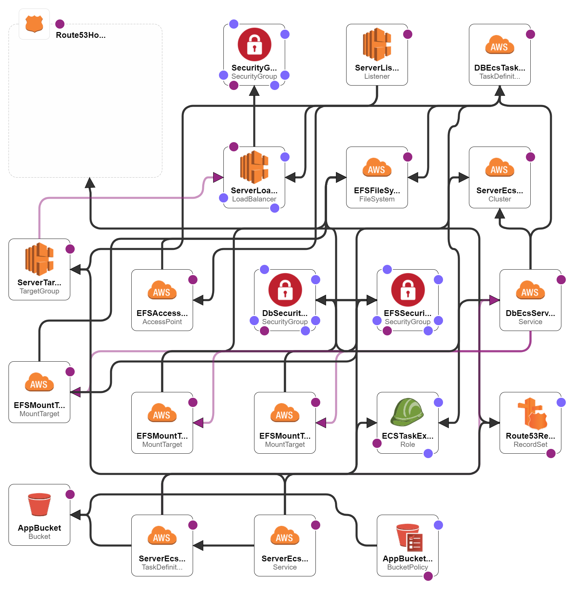

# Weather App Backend

## Overview

This is a backend server application for [Weather app](http://weather.xixi2020.com) or [Weather app AWS](http://weather.xixi2020.com.s3-website-ap-southeast-2.amazonaws.com) (if the first url expires), which allows users to search for weather information for a given city. The frontend part is [here](https://github.com/Mason-Yao/weather-app.git). 

This repository contains the backend server for the application, which provides REST API endpoints for retrieving weather data, user authentication and registration, and managing user profiles. The weather data are requested from https://www.weatherapi.com, which will be stored in memory for 2 minutes to improve performance. 


## Technologies Used

* Node.js
* Express
* MongoDB
* Mongoose
* Passport.js local strategy
* Passport.js Google OAuth2.0 strategy
* Weather API

## API Endpoints

### Authentication

* POST /auth/register: Register a new user account
* POST /auth/login: Log in to an existing user account using a username and password
* GET /auth/google: Initiate authentication via Google OAuth2
* GET /auth/google/user: Handle Google OAuth2 callback and log in or register the user
  
### User Management

* GET /user: Retrieve the currently authenticated user's profile information
* PUT /user/cities: Update the currently authenticated user's list of saved cities
  
### Weather Data

* GET /weather/:city/forecast: Retrieve weather forecast data for the specified city

## Getting Started

### Prerequisites
* Node.js v18
* MongoDB v6
* Weather API key (get one at https://www.weatherapi.com/)

### Local Installation
1. Clone the repository:
   ```
   git clone https://github.com/Mason-Yao/weather-server.git
   ```

2. Install dependencies:
   ```
   cd weather-server
   npm install
   ```

3. Set up environment variables:
   Change the content in .env file with your own values.

4. Start the application with nodemon monitoring
   ```
   npm start dev
   ```

5. The application should now be running on FRONTEND_URL with  default value http://localhost:13000 if no environment variables passed over.  

# Deploy

The project can be deployed on AWS serverless. The backend and Mongodb database are running on ECS with Fargate mode. An Application Load Balancer is provided to route frontend traffic to ECS container. The backend app will be pushed to AWS ECR. The official image `mongo` is used for database service and EFS will be mounted to the mongo container to store user information. The frontend application will be running on S3 with a registered DNS record routing traffic from a public domain. 

## AWS structure



## Getting started

### Create and register docker image for backend application. 

1. create a Dockerfile in root directory of the weather-server project.
   ```
   FROM node:18-alpine

   # Set the working directory in the container to /app
   WORKDIR /app

   # Copy the package.json and package-lock.json files to the container
   COPY package*.json ./

   # Install dependencies
   RUN npm install

   # Copy the rest of the application code to the container
   COPY . .

   # Expose port 13000 for the application
   EXPOSE 13000

   # Define the command that runs the application
   CMD [ "npm", "start" ]
   ```
   
2. Create a new repository on aws ECR and run following command to build image and push it to ECR repository.
   ```
   docker login -u AWS -p $(aws ecr get-login-password --region ap-southeast-2) xxxxxxxxx.dkr.ecr.ap-southeast-2.amazonaws.com
   docker build -t weather-server .
   docker tag weather-server:latest xxxxxxxxx.dkr.ecr.ap-southeast-2.amazonaws.com/weather-server:latest
   docker push xxxxxxxxx.dkr.ecr.ap-southeast-2.amazonaws.com/weather-server:latest
   ```

3. Upload weather.yaml to AWS cloudformation console. It will create following resources:
   The CloudFormation stack creates the following resources:

   * S3 bucket for frontend application .
   * Application load balancer for balancing api calls or direct visiting to backend server.
   * Target groups and listener rules for the load balancer.
   * Backend server ECS cluster, ECS task definition and ECS service. 
   * Mongodb ECS cluster, ECS task definition and ECS service. 
   * EFS mounted to Mongodb container.
   * Access point and mount targets for EFS.
   * Security groups and IAM roles for different services accordingly.
  
4. When the cloudformation stack completes, record the output load balancer DNS and modify `backendUrl` in frontend application weather-app directory with the value. 

5. Build the frontend weather-app application with 
   ```
   run build
   ```

6. Upload files and folds under build directory to the S3 bucket. 


